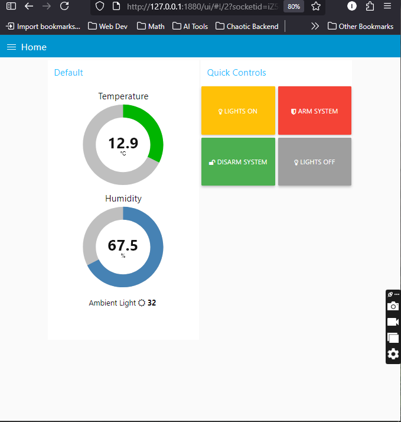

# 🏠 Smart Home System Simulation with Wokwi



## 🌐 Overview

This project simulates a **comprehensive Smart Home System** using the **Wokwi electronics simulator**.  
It integrates multiple sensors and actuators controlled by an **ESP32 microcontroller**, featuring **MQTT cloud connectivity** and a **Node-RED dashboard** for real-time visualization and control.

The simulation showcases essential IoT concepts such as:

- Automated lighting control
- Environmental monitoring
- Security and alarm systems

---

## ⚙️ Features

- **Environmental Monitoring** – Real-time temperature and humidity tracking via **DHT22 sensor**
- **Automated Lighting** – Smart LED control based on **ambient light** and **motion detection**
- **Security System** – Motion-activated alarm with **visual** and **audible alerts**
- **Cloud Connectivity** – MQTT protocol integration for remote data flow
- **Interactive Dashboard** – Node-RED dashboard with live visualizations
- **Remote Control** – Arm/disarm the alarm and control lighting remotely

---

## 🧩 Simulated Hardware Components

| Component              | Purpose                           | Connection Details                        |
| ---------------------- | --------------------------------- | ----------------------------------------- |
| **ESP32 Dev Module**   | Central controller                | —                                         |
| **DHT22 Sensor**       | Temperature & humidity monitoring | VCC → 3.3V, GND → GND, DATA → GPIO 15     |
| **PIR Motion Sensor**  | Motion detection                  | VCC → 3.3V, GND → GND, OUT → GPIO 27      |
| **LDR Sensor (4-pin)** | Ambient light measurement         | VCC → 3.3V, GND → GND, SIG → GPIO 34      |
| **Blue LED**           | Smart lighting                    | Anode → 220Ω → GPIO 16, Cathode → GND     |
| **Red LED**            | Status/alarm indicator            | Anode → 220Ω → GPIO 17, Cathode → GND     |
| **Piezo Buzzer**       | Audible alarm                     | Positive → GPIO 26, Negative → 100Ω → GND |

---

## 💻 Software Dependencies

### Development Environment

- **Arduino IDE 2.x**
- **ESP32 Board Package**
- Required Libraries:
  - `DHT sensor library` (Adafruit)
  - `PubSubClient` (Nick O’Leary)
  - `WiFi` (built-in)

### Cloud & Tools

- **HiveMQ Public MQTT Broker** (`broker.hivemq.com:1883`)
- **Node-RED** (local or cloud)
- **MQTT Explorer** (for topic monitoring)

---

## 🚀 Setup Instructions

### 1️⃣ Wokwi Circuit Setup

1. Open [Wokwi](https://wokwi.com)
2. Import the circuit configuration:
   ```json
   https://github.com/allamimad/smart-home-wokwi/blob/main/wokwi/smart-home-circuit.json
   ```
